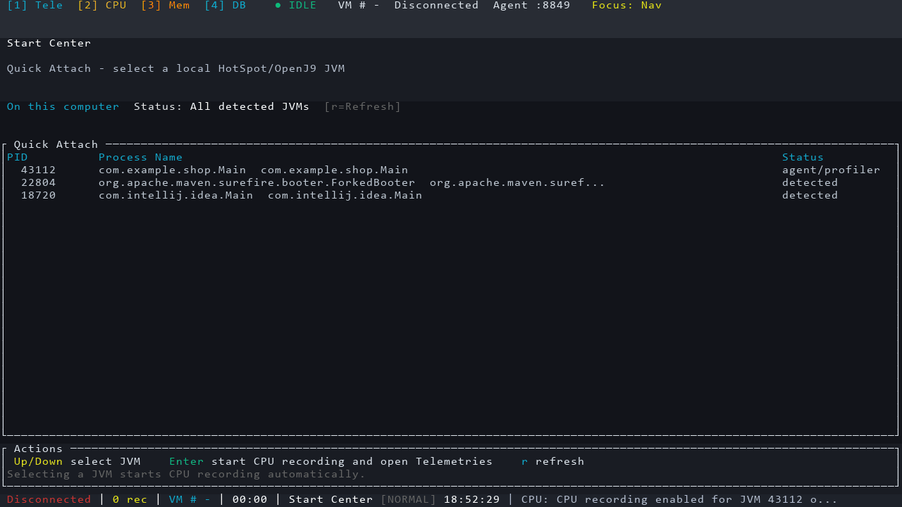
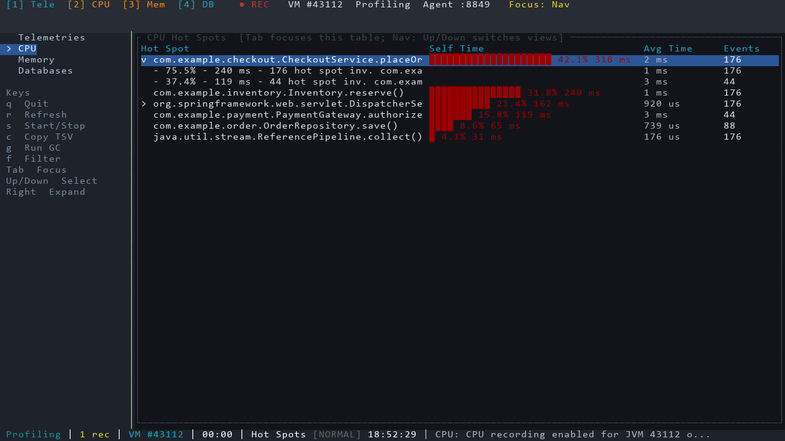
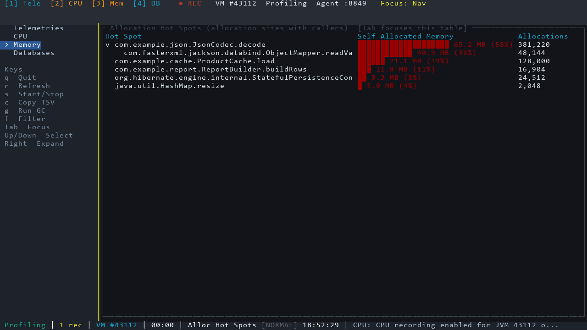
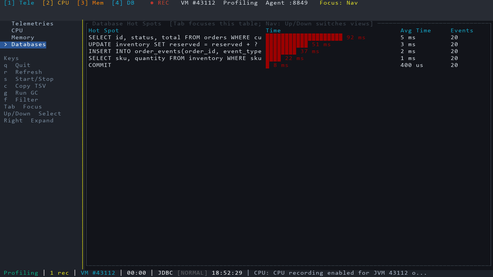

# OpenProfiler TUI

OpenProfiler TUI is a small Java profiler prototype with a terminal UI, a Java instrumentation agent, and a native JVMTI timing helper.

The project is intentionally scoped to the TUI workflow. It does not include the older GUI client, generated build output, or local distribution artifacts in source control.

## Features

- Attach to a local HotSpot/OpenJ9 JVM from the start screen.
- Start CPU recording automatically after JVM selection.
- Show CPU hot spots with method name, self time, total time, invocation count, and average time.
- Show SQL hot spots in the Databases view when JDBC probes produce `SQL` hot spot rows.
- Show JVM telemetry, class histogram memory data, allocation hot spots, and thread dumps.
- Copy visible table data as TSV to the OS clipboard.
- Build release bundles for Windows, Linux, and macOS.

## TUI Screenshots

The screenshots show the start center and the main profiling views for CPU, memory allocation, and JDBC hot spots.









## Repository Layout

```text
crates/core/              Shared models, JVM discovery, platform helpers, and protocol client
crates/tui/               ratatui UI, key handling, rendering, scripted smoke commands
crates/core/src/proto/    prost-generated protocol types
proto/                    Protocol schema
java-agent/               Java instrumentation agent and TCP server
crates/jvmti-agent/       Native JVMTI/JNI timing helper
tools/                    Attach helper and release packaging script
docs/                     Maintainer documentation
.github/workflows/        CI and release automation
```

## Requirements

- Rust stable
- JDK 11 or newer
- Maven 3.9 or newer
- PowerShell 7+ for the packaging script on Linux/macOS; Windows PowerShell also works on Windows

## Build

```powershell
cargo build -p oprofiler-tui --release
mvn -q -f java-agent/pom.xml package
cargo build -p jvmti-agent-rust --release
```

## Test

```powershell
cargo fmt --check
cargo test
mvn -q -f java-agent/pom.xml package
```

## Package

```powershell
./tools/package-release.ps1 -Archive
```

The release bundle contains:

- `oprofiler-tui(.exe)`
- `java-agent-0.1.0.jar`
- `jvmti_agent_rust.dll`, `libjvmti_agent_rust.so`, or `libjvmti_agent_rust.dylib`
- `attach/AttachAgent.class`

## Quick Smoke Check

Start a Java application with the agent:

```powershell
$port = 18849
$jar = Resolve-Path java-agent/target/java-agent-0.1.0.jar
$native = Resolve-Path target/release/jvmti_agent_rust.dll
java "-javaagent:$jar=port=$port,native=$native,includes=com.example" -cp app.jar com.example.Main
```

In another terminal:

```powershell
target/release/oprofiler-tui.exe --hotspots-once --port 18849 --record-ms 500
```

## Current Scope

This is a profiler prototype, not a full JProfiler replacement. The protocol schema contains commands that are not fully implemented yet. The supported path is the bundled Java agent plus the TUI client.

## License

MIT
